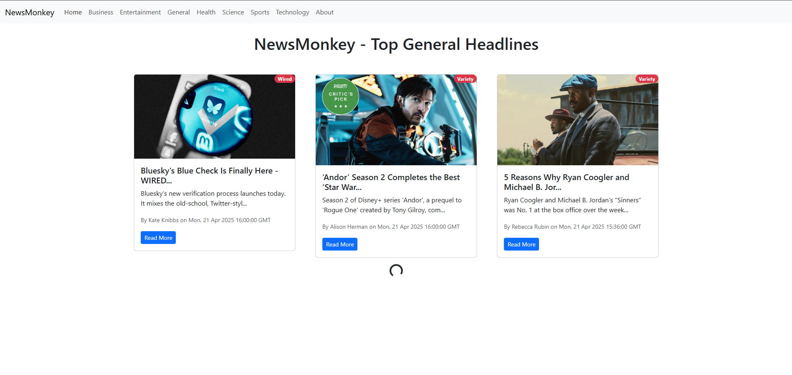
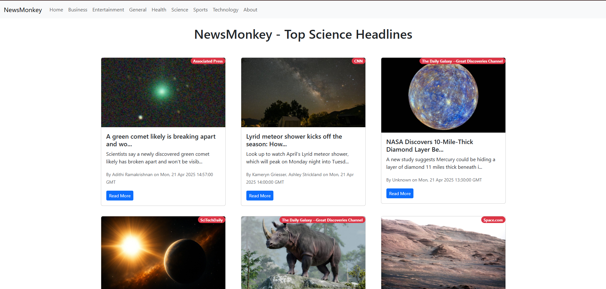

# 📰 NewsMonkey - React News App

NewsMonkey is a responsive, category-based news application built using React JS. It fetches the latest headlines from around the world using the NewsAPI and displays them in a clean, user-friendly interface. The app is optimized with infinite scroll, top-loading progress bar, and intuitive navigation.

General news headlines showcased in card format with source badge, summary, author, and publication time.

## 🔧 Features

- 🌐 Multiple News Categories: Choose from Business, Entertainment, Health, Science, Sports, Technology, and more.
- 🔁 Infinite Scroll: Load more news articles as you scroll down, enhancing user experience without extra clicks.
- 🚀 Loading Bar: A smooth top loading bar gives visual feedback during API fetch operations.
- 📱 Responsive UI: Fully responsive layout for all devices (desktop, tablet, mobile).
- 🔍 Source Tags: News cards display publisher names like "WIRED", "CNN", etc., giving authenticity to the content.
- 📅 Published Details: Cards include the author's name and article's date and time for credibility.

## 🧱 Tech Stack

- React JS
- React Router
- React Top Loading Bar
- NewsAPI.org
- HTML/CSS

## 📸 Screenshots

